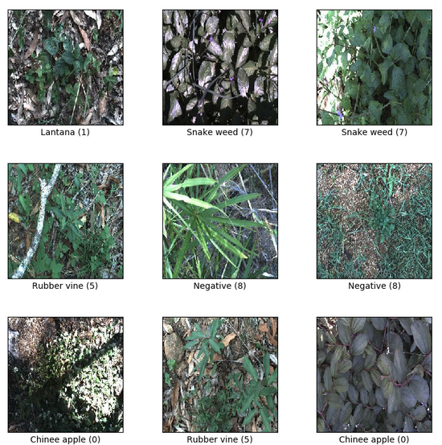
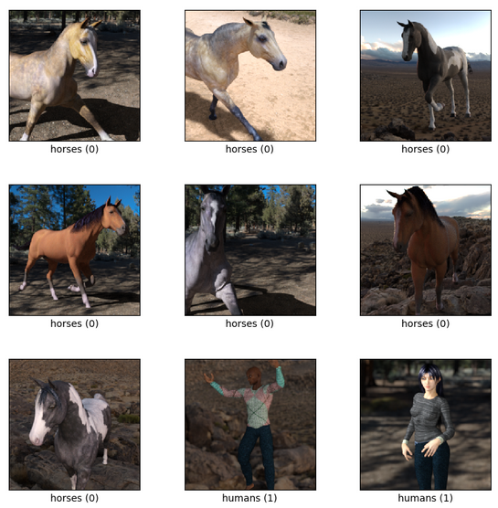
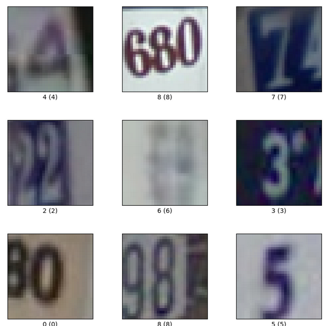
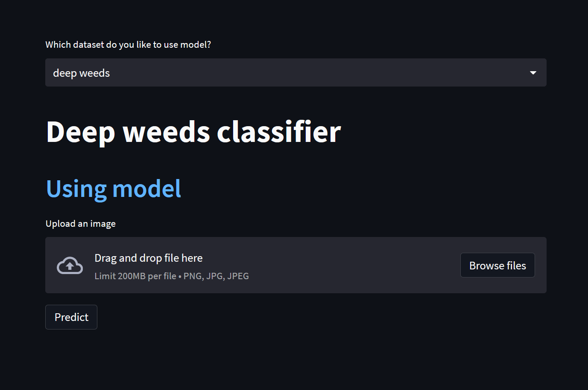
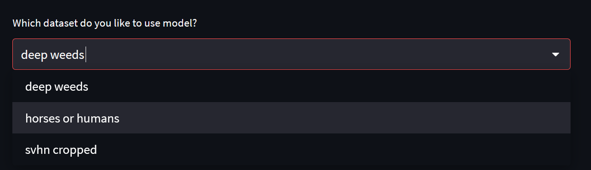
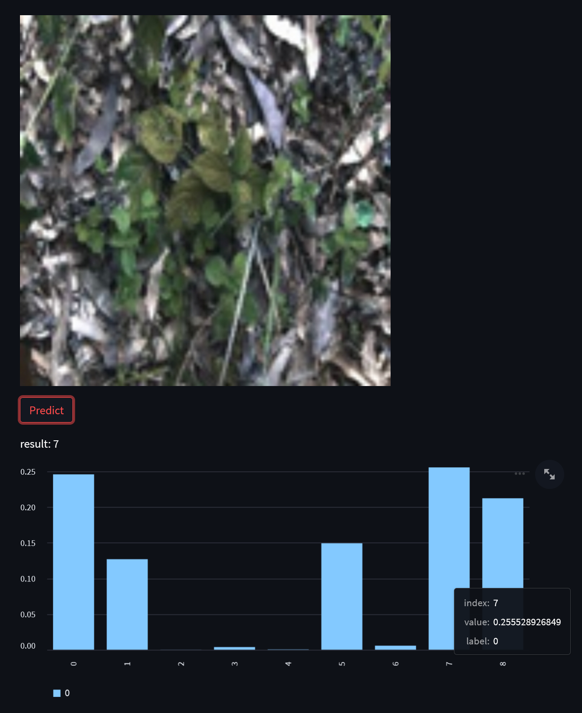

[](https://colab.research.google.com/drive/1I6luziQ7KcPw-uMqHwJSoaqnsSpYD0Vw?usp=share_link)

# About datasets

## <span style="color:red">Deep weeds</span>

The [DeepWeeds](https://www.tensorflow.org/datasets/catalog/deep_weeds) dataset consists of 17,509 images capturing eight different weed species native to Australia in situ with neighbouring<br> flora.The selected weed species are local to pastoral grasslands across the state of Queensland.The images were collected from weed <br>infestations at the following sites across Queensland: "Black River", "Charters Towers", "Cluden", "Douglas", "Hervey Range", <br>"Kelso", "McKinlay" and "Paluma".

Image shape: (224, 224, 3)<br>
Number classes: 9

<a></a>

## <span style="color:green">Horses or humans</span>

The [Horses or humans](https://www.tensorflow.org/datasets/catalog/horses_or_humans) dataset consists of 1,027 train images and 256 test images for horses and humans. <br>
Homepage: [datasets](http://laurencemoroney.com/horses-or-humans-dataset)

Image shape: (300, 300, 3)<br>
Number classes: 2

<a></a>

## <span style="color:orange">Svhn_cropped</span>

The Street View House Numbers (SVHN) Dataset is an image digit recognition dataset of over 600,000 digit images coming from real world data. Images are cropped to 32x32.

Image shape: (32, 32, 3)<br>
Number classes: 10

<a></a>

# <span style="color:red">Models</span>

Datasets is trained with tensorflow API. GPU is recommended for this datasets. Because it takes a lot of time on cpu.<br>
Models in [google drive](https://drive.google.com/drive/folders/1AQFq_Rizt5sdk5KVVbqr4hDPnx9otp9C?usp=sharing).

# Installation

1. Install python

- requirement version 3.x <span style="color:yellow">**x = {7,8,9}**</span>

2. Create virtual environment

- pip install virtualenv
- python -m venv {name of virtual environment}
- activate it<br>
- - On Windows
- - - C:/path to your env/Scripts/activate
- - On Linux
- - - path to your env/bin/activate

3. `pip install -r requirements.txt`

### Usage of [Streamlit](https://github.com/streamlit/streamlit.git)

```
streamlit run stream.py
```

The result is as follows:

<a></a>

You can select the dataset you want to use by:

<a></a>

Result of the model is shown as floows:

<a></a>

## Features

### Deep Learning

- we have deep neural network with [tensorflow](https://github.com/tensorflow/tensorflow.git)
- run in colab [](https://colab.research.google.com/drive/1I6luziQ7KcPw-uMqHwJSoaqnsSpYD0Vw?usp=share_link)
